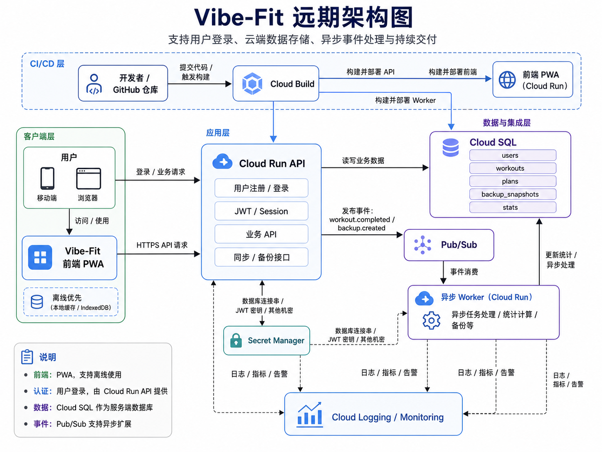

# 系统架构

VibeFit 当前是一个移动端优先 PWA，后续 GCP 改造目标是增加轻量 API、云端备份、异步统计和可观测性。该项目没有 Kubernetes 原生依赖，不需要复杂服务编排、服务网格、自定义调度、Operator、共享集群平台或复杂网络策略。

因此当前优先选择 Cloud Run。Cloud Run 能满足前端静态服务、后端 API、异步 Worker 和 CI/CD 部署需求，并且更符合优先全托管、降低运维复杂度的原则。

只有未来出现 Kubernetes 生态依赖或多服务平台化治理需求时，才重新评估 GKE Autopilot。



## 部署架构

| 模块     | 本地开发环境                                            | 生产环境                                        | 建议                                                  |
| -------- | ------------------------------------------------------- | ----------------------------------------------- | ----------------------------------------------------- |
| 前端     | Vite dev server 或已部署的 dev Cloud Run 前端           | Cloud Run 前端服务                              | 已经完成前端部署，可继续保留本地 dev + 线上 prod 两套 |
| 后端 API | 本地 Node.js + TypeScript + Fastify                     | Cloud Run API                                   | `m2-backend-api` 先做本地 API，不急着上 Cloud SQL     |
| 数据库   | Docker PostgreSQL                                       | Cloud SQL PostgreSQL                            | 本地和生产都用 PostgreSQL，降低迁移成本               |
| 登录     | 开发模式 mock user / dev JWT / Google OAuth 测试 client | Google 登录 / Identity Platform / Firebase Auth | 开发环境不要依赖生产登录                              |
| 密钥     | `.env.local`                                            | Secret Manager                                  | 本地可以用 `.env`，生产必须用 Secret Manager          |
| 消息队列 | 先用函数调用或 EventEmitter，进阶用 本地 workder        | Pub/Sub                                         | 不要一开始被 emulator 卡住，先跑通业务事件            |
| Worker   | 本地单独启动 `worker` 服务，或先内联处理                | Cloud Run Worker                                | `m5` 再拆成独立 worker                                |
| 日志     | Console log / pino logger                               | Cloud Logging                                   | 从第一天就用结构化日志                                |
| 监控     | 本地不做完整监控                                        | Cloud Monitoring                                | 生产阶段补 error rate、latency、Pub/Sub backlog       |
| CI/CD    | 本地命令 + GitHub Actions                               | Cloud Build / GitHub Actions + Cloud Run        | 先别急，等 API + DB 稳定后再自动化                    |

### 本地开发环境

```
浏览器 / 前端 dev server
  ↓
Vite frontend
  ↓ HTTP
Backend API，本地 Node.js / Fastify
  ↓
Docker PostgreSQL
  ↓
本地事件模拟
  ├── 方案 A：直接函数调用 / EventEmitter
  └── 方案 B：本地 Worker HTTP endpoint
```

### GCP生产环境

```
用户浏览器
  ↓
Vibe-Fit Frontend on Cloud Run
  ↓ HTTPS
Cloud Run API
  ↓
Cloud SQL PostgreSQL
  ↓
Pub/Sub
  ↓
Cloud Run Worker
  ↓
Cloud Logging / Monitoring
```

## 前端技术架构

## 前端技术栈

| 技术                    | 用途                         |
| ----------------------- | ---------------------------- |
| **React 19**            | UI 框架                      |
| **TypeScript**          | 类型安全                     |
| **Vite 7**              | 构建工具                     |
| **MUI (Material UI) 7** | UI 组件库                    |
| **Zustand**             | 状态管理                     |
| **Dexie.js**            | IndexedDB 封装（本地数据库） |
| **Vite PWA**            | 渐进式 Web 应用              |

### 状态管理架构

```
┌─────────────────────────────────────────────────────────┐
│                    Zustand Stores                       │
├─────────────────┬─────────────────┬─────────────────────┤
│   planStore     │  sessionStore   │   settingsStore     │
│  (训练计划)     │  (训练会话)     │    (应用设置)        │
└────────┬────────┴────────┬────────┴──────────┬──────────┘
         │                 │                   │
         └─────────────────┼───────────────────┘
                           ▼
                  ┌─────────────────┐
                  │   Dexie (IDB)   │
                  │   本地数据库    │
                  └─────────────────┘
```

## 后端技术栈
